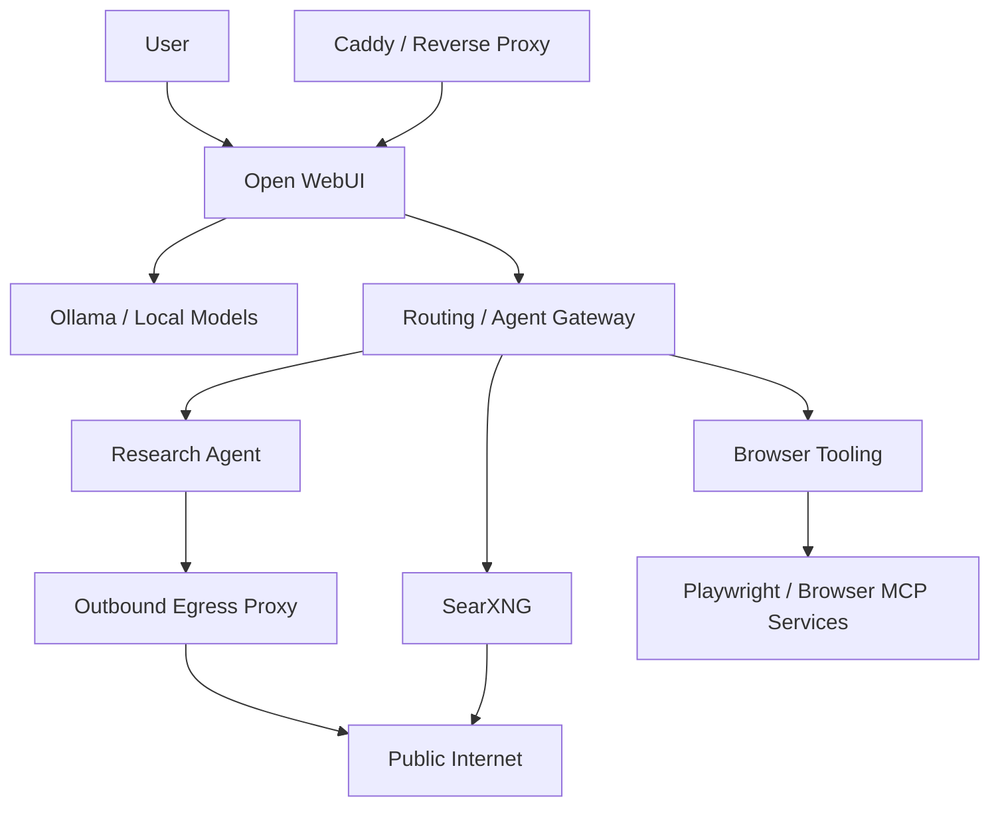

# Self-Hosted AI Platform

A self-hosted AI platform I’ve been building to explore local inference, agent tooling, browser access, service isolation, and the practical side of running modern AI systems on hardware I control.

The goal wasn’t just to get a model running. I wanted the system to be usable day to day, reasonably secure, observable enough to debug, and flexible enough to keep evolving without turning into a fragile pile of one-off services.

## What the platform includes

- Local LLM inference with GPU acceleration
- Containerized AI and support services
- A web UI for interacting with local models
- Search integration through SearXNG
- Browser and Playwright-based tooling for agent workflows
- Routing and gateway services between model, search, and browser components
- Multiple agent-oriented services
- Reverse proxy / HTTPS termination
- Network segmentation between public-facing and internal services
- Proxy enforcement for outbound research traffic
- SSRF protections around private and metadata address ranges
- Reduced-privilege execution for higher-risk services

## High-level architecture

This is intentionally simplified. The actual environment contains multiple isolated Docker networks and supporting services, but I avoid publishing internal addressing or deployment-specific details here.

## Core technologies

**Host / virtualization**  
Proxmox VE · Ubuntu LXC · Linux

**AI / inference**  
Ollama · local LLMs · NVIDIA GPU acceleration

**Application / platform services**  
Open WebUI · SearXNG · Valkey · Caddy · Docker

**Agent / browser tooling**  
Research-agent services · Playwright MCP · browser relay / gateway services · controlled outbound proxying

## Security work

One of the more useful parts of the project has been treating the AI tooling as software that can be exposed to hostile input rather than assuming a model is inherently trustworthy.

Some of the controls I added include:

- outbound proxy enforcement for research traffic
- private-network and metadata-address blocking
- separation of browser-facing services from internal model/search services
- non-root execution where practical
- read-only root filesystems for selected services
- removal of unnecessary Docker socket access
- explicit allow/deny boundaries between networks
- validation against loopback, RFC1918, Docker bridge, metadata, and IPv6 loopback targets

The point of those controls is not to claim the environment is perfectly secure. It’s to reduce the blast radius of prompt injection, SSRF-style requests, unsafe browser behavior, or a compromised service.

## What I learned from building it

A few things stood out while working through the project:

- AI infrastructure becomes a networking and systems problem very quickly.
- Browser access is one of the highest-risk capabilities to give an agent and deserves its own isolation boundary.
- A model being local does not automatically make the surrounding system safe.
- GPU setup is only one layer; container permissions, device access, routing, proxies, and service dependencies matter just as much.
- Debugging distributed local services is much easier when each layer has a clear responsibility.
- Security improvements often require revisiting architecture rather than adding one more filter at the edge.

## Current status

This is an active project rather than a finished product. The core platform is running, local inference is GPU-accelerated, browser/search workflows are integrated, and the main security-hardening baseline has been tested against a set of private-network and metadata targets.

I’m continuing to use the platform as a way to learn more about agent architecture, local inference, service isolation, model/tool boundaries, and practical AI infrastructure.

## Public-repo note

This repository is a sanitized engineering case study. It intentionally leaves out private IPs, internal DNS names, credentials, secrets, and deployment-specific configuration from the live environment.
